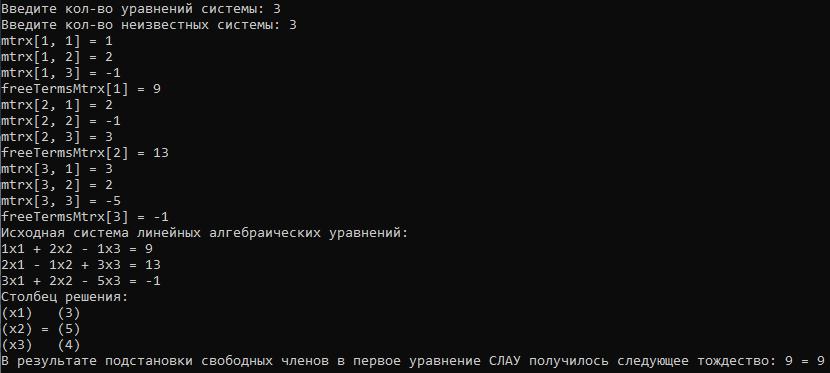
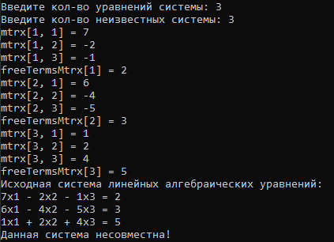

<h1 align="center">SLAE Gauss Solver</h1>

<h3 align="center">A console application aimed at solving systems of linear algebraic equations using the Gaussian elimination method</h3>

	
	

## Experience

I have practised: OOP, encapsulation, templates, operator overloading, friend functions, writing unit tests.